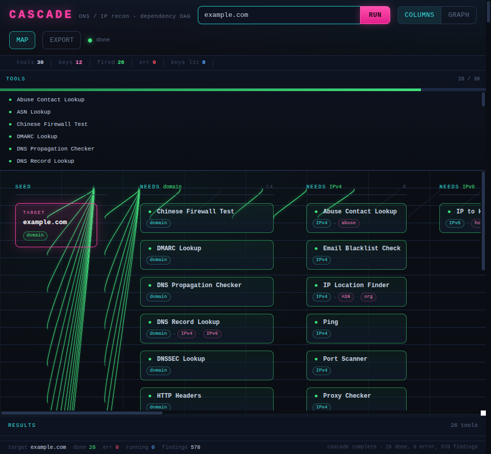
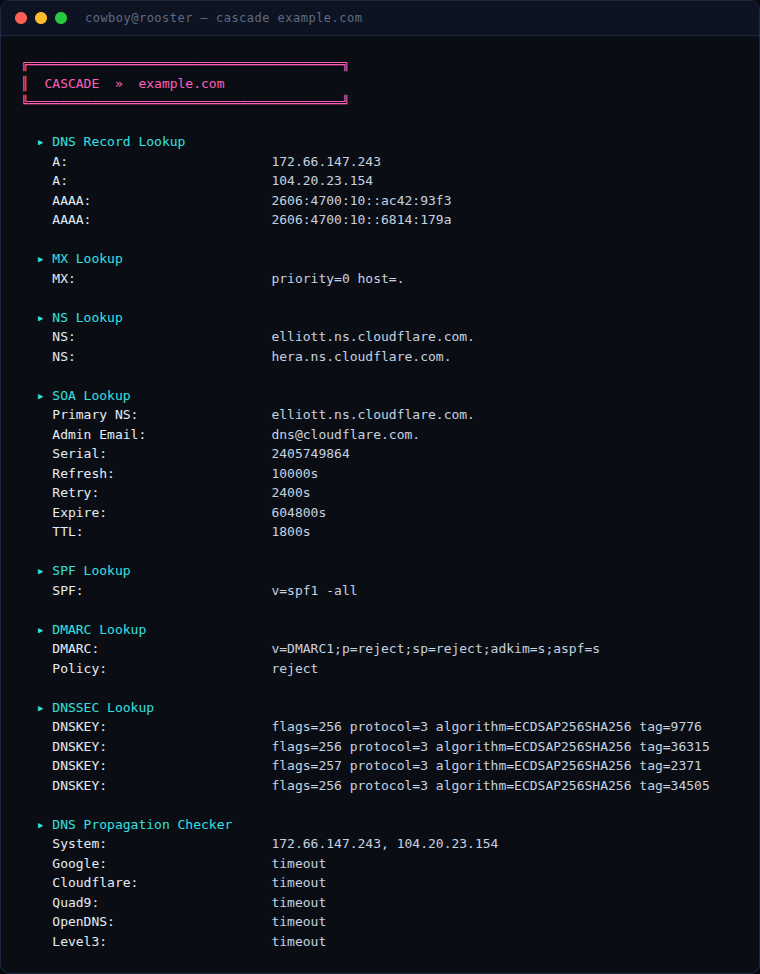

# cascade

DNS/IP reconnaissance cascade. Seed one value — domain, IP, email, or MAC — and every tool whose inputs are satisfied fires automatically, feeding its outputs into the next layer until the graph is saturated. 30 lookups, no API keys.



```
go install github.com/nuclide-research/cascade@latest
```

## Two interfaces, one engine

- **CLI** — `cascade <target>`, streamed to the terminal, `-j` for JSON.
- **GUI** — `cascade gui`, a live dependency-DAG in the browser, streamed over Server-Sent Events.

Both share the same 30-tool registry and cascade engine. Pure Go, no CGo — builds for Linux and Windows with plain `go build`.

## How the cascade works

You provide one seed. cascade detects its type (IPv4, IPv6, domain, email, MAC) and runs every tool whose required inputs exist. Each tool's outputs (an IP, a hostname, an ASN, an MX host, a registrant email) become inputs for the next wave. A single domain fans out into DNS, WHOIS, and abuse-contact lookups; the resolved IP feeds geolocation, port scanning, reverse-IP and blacklist checks; the derived hostname, ASN, and org chain even further. A null result is logged, not a dead end.

## CLI

```
cascade <target> [-j output.json]
```

```
cascade cloudflare.com
cascade 104.16.133.229
cascade user@example.com
cascade 00:50:56:ab:cd:ef
cascade cloudflare.com -j results.json
```



## GUI

```
cascade gui
```

Binds `127.0.0.1` on a free port, opens your browser, and serves the UI from the binary itself (assets embedded with `go:embed` — nothing to install, no external CDN). Type a target and watch the cascade propagate: the seed node fans data-keys out to the tools that consume them, and each tool animates idle → running → done/error as results stream into the panel on the right. Toggle between the layered **columns** view and a **graph** view, then export the whole run as JSON.

## Tools

| Tool | Input |
|------|-------|
| DNS Record Lookup | domain |
| MX Lookup | domain |
| NS Lookup | domain |
| SOA Lookup | domain |
| SPF Lookup | domain |
| DMARC Lookup | domain |
| DNSSEC Lookup | domain |
| DNS Propagation Checker | domain |
| Whois Lookup | domain |
| HTTP Headers | domain |
| IP History | domain |
| Chinese Firewall Test | domain |
| Iranian Firewall Test | domain |
| Traceroute | domain |
| Find Shared DNS Servers | ns_host (from NS Lookup) |
| Spam Database Lookup | mx_host (from MX Lookup) |
| Reverse Whois Lookup | registrant_email (from Whois) |
| Reverse DNS Lookup | ipv4 |
| IP Location Finder | ipv4 |
| Abuse Contact Lookup | ipv4 |
| Port Scanner | ipv4 |
| Ping | ipv4 |
| Reverse IP Lookup | ipv4 |
| Email Blacklist Check | ipv4 |
| Proxy Checker | ipv4 |
| IP to Hostname | ipv6 |
| Hostname to IP | hostname (from Reverse DNS) |
| ASN Lookup | asn (from IP Location) |
| Free Email Lookup | email |
| MAC Address Lookup | mac |

No API keys required. Lookups use system DNS, public WHOIS/RDAP, and free no-key endpoints.

## Build from source

```
git clone https://github.com/nuclide-research/cascade
cd cascade
go build -o cascade .

# cross-compile (pure Go, no CGo)
GOOS=linux   go build -o cascade .
GOOS=windows go build -o cascade.exe .
```

## License

MIT. Part of the NuClide toolchain.
